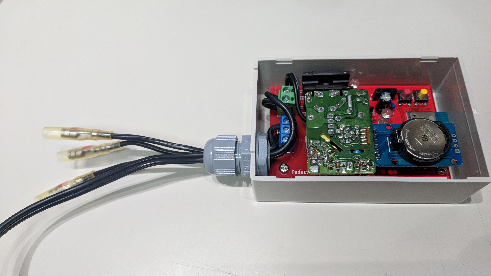

# How to assemble PedestrianController.

* This is point for assemble parts from naked plain board.

## Assemble ESP-WROOM-02

* Light stick ESP-WROOM-02 to board.

* We have to fix shifted position for ESP-WROOM-02 and do solder.

* Mount switches.

* Finished partial mounting because we have to test before assemble all parts.

## Write PedestrianController firmware.

* Connect header "CON1" to USB-serial converter.
  * Caution: We must not mistake power line between 3.3V and GND.
  * I use this converter: [High power USB-Serial converter (In japanese)](https://www.switch-science.com/catalog/3422/)

* Before write, we do power up (Connect serial converter to USB) and reset for firmware-write mode by mounted switches.
  * Swithces-on-off sequence is bit complex.
  * See also the video: https://youtu.be/IjTIz9GXHyo 

* Select "Generic ESP8266 Module" at Arduino IDE.
  * And select these menu items (include your USB port "COM?")

* This is writing log.
  * After wrote firmware, We can see LED's grow sequence. See also the video: https://youtu.be/FbDNfWrt7zE

* And outout debug log. It contains initial wifi sequence.
  * Log contains invalid "Current time from RTC", you can ignore this logs.

## Extract power module from AC power supply unit.

## Final assemble steps.

* We have to assemble all parts.
  * Include power terminals (CON3, CON4), SSRs and RTC module header (CON2).

* If RTC module's header pin angled, force straight and insert to header.

* Connect power module onto board.

* Cut longer rigid bases.

* Pre-mount to board.

* All items into the box "TAKACHI SW-100."
