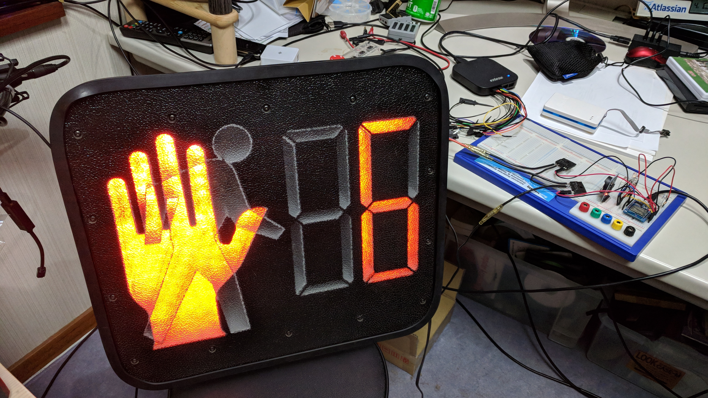
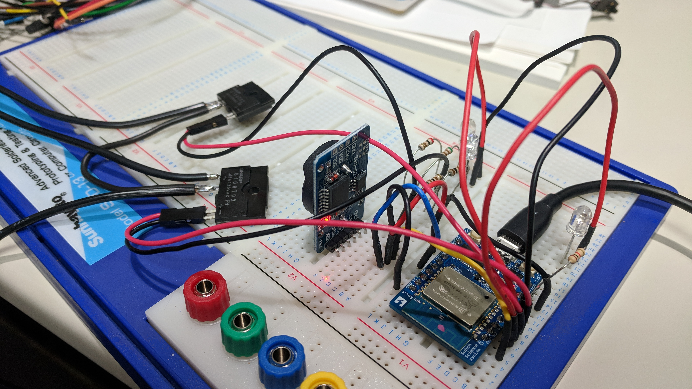
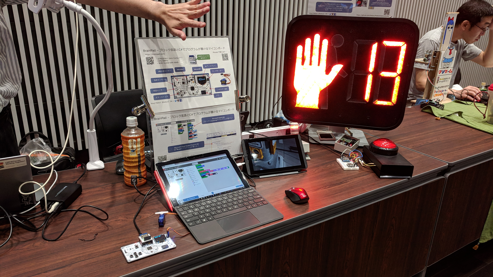
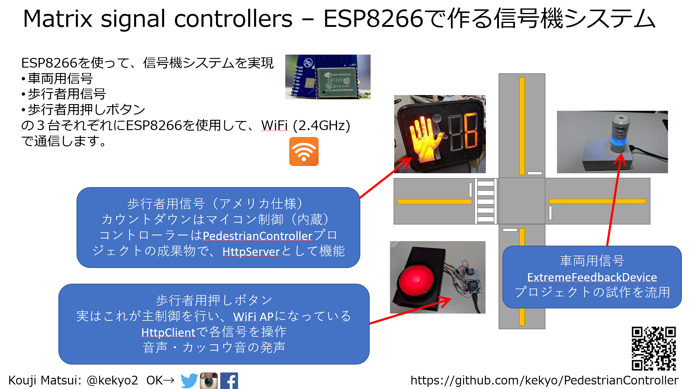
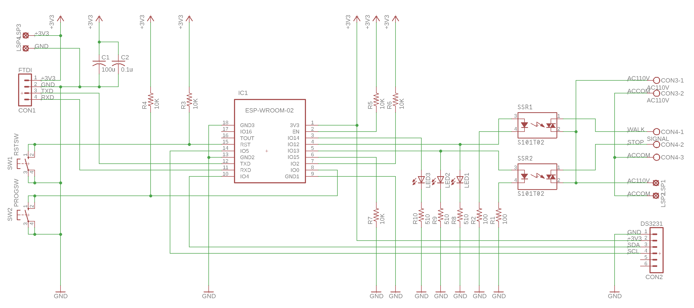
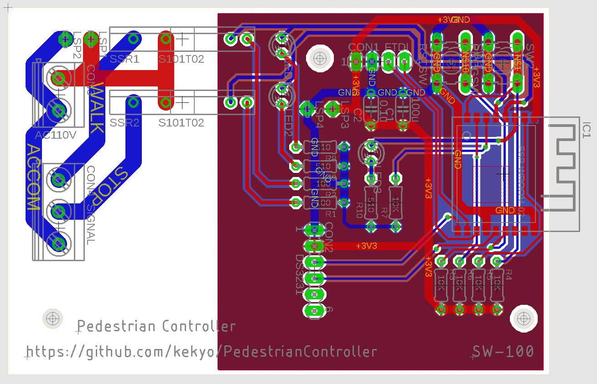
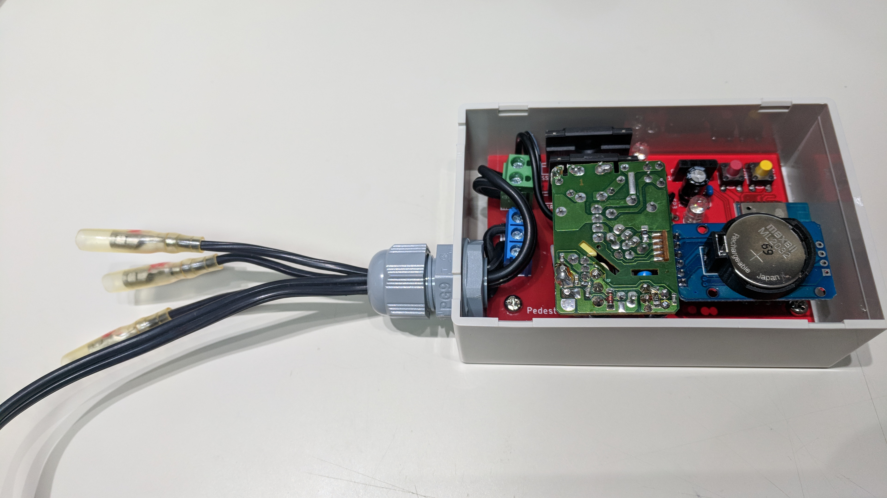

# American pedestrian signal controller on ESP8266

## What's this?

* It's pedestrian signal controller running on ESP8266 (aka ESP-WROOM-02).
* I made custom schematic and artwork from scratch.
  * Use EAGLE 8
* I wrote sequencer code by C++ on ESP8266-Arduino IDE.

### Video

* We record our discussion into YouTube: [Fun with Pedestrian Signal (In japanese)](https://youtu.be/vJiQ18ymqcs)

### NT NAGOYA 2018 conference

## Features

* Basic sequence for american pedestrian signal standard (3 wired control).
* Scheduled time control between signal-on hour and signal-off hour.
* Battery-backuped RTC using scheduler.
* Auto synchronize NTP server with your WiFi AP.

## Schematic and artwork

* I ordered PCB to [Fusion PCB](https://www.seeedstudio.com/fusion_pcb.html) and finished assemble.

## How to assemble PedestrianController

* See also: [How to assemble PedestrianController](HowToAssemble.md)

## License

* Under Apache v2
